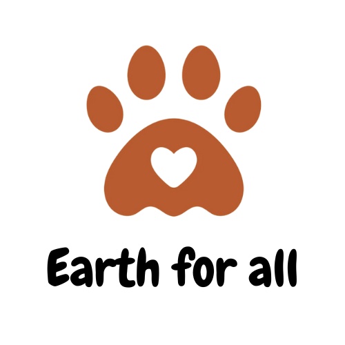

# Earth For All
This project is about a dynamic website about which ccontains the following features :
- food diet for various pets of different breeds
- options for apdotic pets
- reporting inappropriate behaviour towards animals
- rescuing stray animals
- a community for pet lovers
- nearby events or competition for pets
- health and treatment informations

### This project is build for a hackathon `"Hack For A Cause"` conducted by students of amrita school of computing, Amritapuri